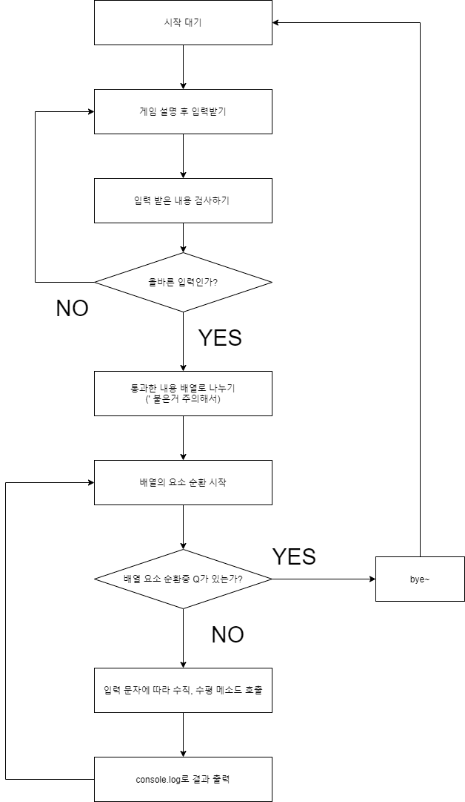

# codeSquad-mastersCourse-test step-2

## 평면 큐브 구현하기

1. 3 X 3의 2차원 배열   
   R R W   
   G C W   
   G B B   

2. 사용자의 입력을 받아서 아래의 동작을 하는 프로그램을 구현하시오.   
   &lt; U 가장 윗줄을 왼쪽으로 한 칸 밀기 RRW -&lt; RWR   
   &lt; U' 가장 윗줄을 오른쪽으로 한 칸 밀기 RRW -&lt; WRR   
   &lt; R 가장 오른쪽 줄을 위로 한 칸 밀기 WWB -&lt; WBW   
   &lt; R' 가장 오른쪽 줄을 아래로 한 칸 밀기 WWB -&lt; BWW   
   &lt; L 가장 왼쪽 줄을 아래로 한 칸 밀기 RGG -&lt; GRG (L의 경우 R과 방향이 반대임을 주의한다.)   
   &lt; L' 가장 왼쪽 줄을 위로 한 칸 밀기 RGG -&lt; GGR   
   &lt; B 가장 아랫줄을 오른쪽으로 한 칸 밀기 GBB -&lt; BGB (B의 경우도 U와 방향이 반대임을 주의한다.)   
   &lt; B' 가장 아랫줄을 왼쪽으로 한 칸 밀기 GBB -&lt; BBG   
   &lt; Q Bye~를 출력하고 프로그램을 종료한다.   

### 요구사항

- 처음 시작화면 초기 상태를 출력한다.
- 간단한 프롬프트 (CLI에서 키보드 입력받기 전에 표시해주는 간단한 글자들 -예:CUBE&lt;)를 표시해준다.
- 한 번에 여러 문자를 입력받은 경우 순서대로 처리해서 매 과정을 화면에 출력한다.

### 예시

    R R W
    G C W
    G B B

    CUBE&lt; UUR

    U
    R W R
    G C W
    G B B

    U
    W R R
    G C W
    G B B

    R
    W R W
    G C B
    G B R

    CUBE> Q
    Bye~

### 2단계 요구사항

- 너무 크지 않은 함수 단위로 구현하려고 노력할 것
- 전역변수의 사용을 자제할 것
- 객체와 배열을 적절히 활용할 것

### 예상 순서도

### 예상하기

우선 입력받은 문장을 나눌 때 단순이 split()나누면 ' 가 포함된 경우 문제가 생긴다.   
step-1에서 사용했던 pushString 함수도 응용해서 사용할 수 있겠지만 step-1에서는 한번에 옮겼고,   
이 경우에는 옮기는 방향이 계속 바뀔 것이라 좀 다르게 접근해야할 것 같다.   

요구사항에 '객체'와 배열을 적절히 활용하라고 하는데 객체를 써야할 이유가 있는지 잘 모르겠다.   
if문을 남발하기보다 입력값을 키로 써서 나오는 값으로 구분하는걸까   

수평 이동은 이중배열의 하나의 요소 안에서 이동하도록   
수직 이동은 이중 배열에서 각 요소의 동일한 인덱스 요소끼리 교환하도록 하면 될 것 같다   

### 결과 순서도 

### 결과

nodejs로 cli를 써보는건 처음이라 input을 비동기로 받고, 그 값을 할당에서 사용하는 구조를 짜는게 생각보다 고됐다..   

그러다보니 처음 예상과 순서도가 꽤 다르게 나왔고   
역시나 입력된 값을 검사하는 과정에 시간이 오래 걸렸다.   

다만 만들다보니 입력값을 '검사'하는 것이 아닌 '수정'해주는 방향으로   되어버렸는데 편리하긴 하지만 사용자의 입력값을 멋대로 바꾸게 되어   
혼란을 주지 않을까? 싶다.   

### 요구사항 자체점검
- 너무 크지 않은 함수 단위로 구현하려고 노력할 것 :star::star::star::star:   
최대한 함수를 쪼갰다고 생각한다.   
너무 쪼개다보니 한 줄짜리 함수가 나오기도 했는데 그 행위가 함수 명으로 표현할 만큼 중요하다?고 생각되면 함수로 만들었다.   

- 전역변수의 사용을 자제할 것   :star::star::star:
cube 배열의 경우 전역변수로서 사용할 수 있긴하지만 인자로 넘기면서 하위 함수에서 접근했다.   
이 경우도 전역변수 사용을 자제하라는 요구사항에 위배되는지 모르겠다.     
- 객체와 배열을 적절히 활용할 것   :star::star::star::star:
commands 객체를 활용한 아이디어가 스스로 마음에 든다.