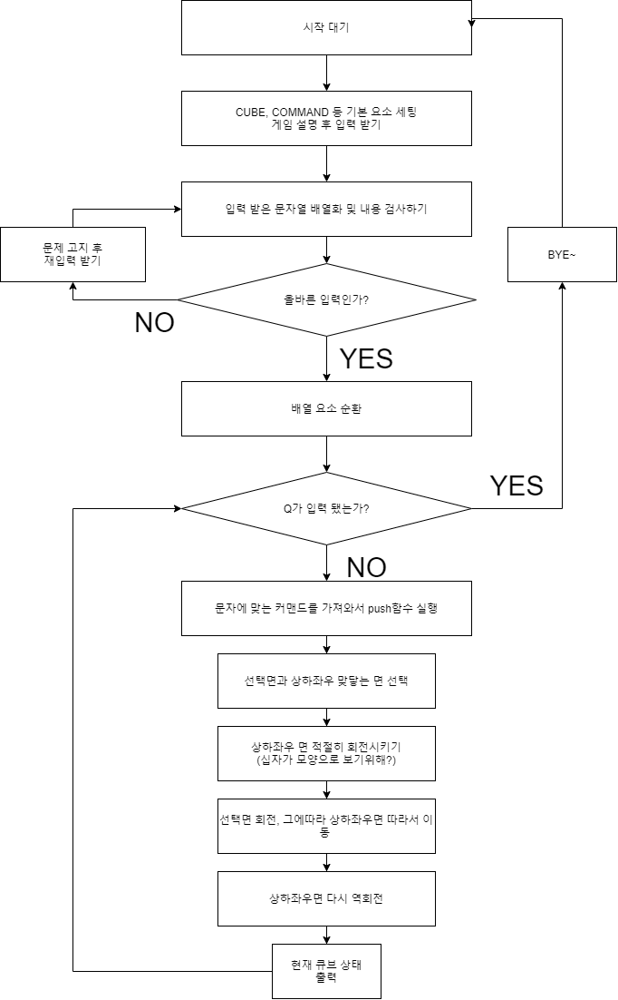

# codeSquad-mastersCourse-test step-3

## 루빅스 큐브 구현하기

- 참고 링크를 참고해서 루빅스 큐브를 구현한다.
- 큐브는 W, B, G, Y, O, R의 6가지 색깔을 가지고 있다.
- 입력: 각 조작법을 한 줄로 입력받는다.
- 출력: 큐브의 6면을 펼친 상태로 출력한다.
- Q를 입력받으면 프로그램을 종료하고, 조작 받은 명령의 갯수를 출력시킨다.

### 큐브의 초기 상태

                    B B B
                    B B B
                    B B B

     W W W     O O O     G G G     Y Y Y
     W W W     O O O     G G G     Y Y Y
     W W W     O O O     G G G     Y Y Y

                    R R R
                    R R R
                    R R R

### 예시

    (초기 상태 출력)

    CUBE> FRR'U2R

    F
    (큐브상태)

    R
    (큐브상태)

    ...

    R
    (큐브상태)

    CUBE> Q
    경과시간: 00:31 //추가 구현 항목
    조작갯수: 6
    이용해주셔서 감사합니다. 뚜뚜뚜.

### 추가 구현 기능

- 프로그램 종료 시 경과 시간 출력
- 큐브의 무작위 섞기 기능
- 모든 면을 맞추면 축하 메세지와 함께 프로그램을 자동 종료

### 3단계 요구사항

- 가능한 한 커밋을 자주 하고 구현의 의미가 명확하게 전달되도록 커밋 메시지를 작성할 것
- 함수나 메소드는 한 번에 한 가지 일을 하고 가능하면 20줄이 넘지 않도록 구현한다.
- 함수나 메소드의 들여쓰기를 가능하면 적게(3단계까지만) 할 수 있도록 노력해 본다.

        function main() {
          for() { // 들여쓰기 1단계
              if() { // 들여쓰기 2단계
                  return; // 들여쓰기 3단계
              }
          }
        }

### 예상 순서도

### 예상하기

step-2에서 '검사' 대신 '조정'을 해준 것을 '검사'하는 로직으로 다시 바꿀 예정이다.  
틀리면 틀렸다고 알려주고 다시 입력받도록. 다만 '왜' 틀렸는지 그 부분까지 말해주는건 어려울지도 모르겠다.  
또한 이번에는 숫자가 포함돼서 RU3R이면 R1번, U3번, R1번 으로 돌아가야해서 숫자에 관한 검사, 동작도 추가해야한다...

그 외에 회전은 step-2를 응용하면 될거같지만 회전하면서 옆에 면들을 같이 움직이게하는게 좀 복잡하다.  
각 면마다 맞닿아있는 부분이 달라서 이중배열의 인덱스가 동일하지 않다. 어떤면은 세로, 어떤면은 가로라서 ..

물리적인 제약이 없으니 해결법으로 선택된 면 기준 상하좌우면을 가져오되, 상황에 맞게 '돌려서' 가져온다.  
그 후에 동일한 회전 함수를 적용하고, '돌린만큼' 다시 '역으로 돌려서' 하면 될거같다.  
말로 설명하기 애매하기 이미지를 첨부한다.

### 그림 예시

이처럼 각 면마다 이어져있는 부분이 다 달라서 하드코딩으로 하나하나 지정해도 되지만

이런 느낌의 과정으로 하면 각 면마다 상하좌우에 맞닿는 면을 가져올때 적당히 돌려서 가져오기만 하면  
그 후에는 같은 함수를 써서 처리할 수 있을 듯하다.

### 결과 순서도

### 결과

앞서 수행한 1, 2단계 논리를 3단게에 적용하지 못 하고 새로운 방법으로 큐브를 돌리고, 옮겨서 좀 아쉽다. 처음부터 3단계까지 철저하게 고려해서 1, 2단계를 진행했다면 재사용성을 높일 수 있었을텐데..

### 함수 설명

#### - init()

defaultData파일에서 기본 값을 가져오고, 게임에 사용될 큐브, 상태값들을 초기화해서 return한다

#### - startGame(init)

init함수에서 초기값들을 받아 팔요한 함수들을 호출하며 게임을 진행한다.

#### - proceedByStr(inGameCube, COMMANDS, array, inGameState)

검사가 완료된 입력값이 담긴 array에서 str을 하나씩 뽑아내 그에 맞게 게임을 진행한다.

#### - deepCopyCube(original)

default cube 객체의 값을 복사한 객체를 반환한다. (참조복사 x)

#### - explainRule(RULE)

게임 시작시 게임에 대한 설명을 안내한다.

#### - inputText()

입력값을 받아 비동기 처리를 위해 promise로 반환한다.

#### - converInputToArray(text)

입력받은 text를 ', 2를 고려해서 올바른 형태의 str로 만들어 배열에 담아 반환한다.

#### - checkIsWrongInput(array)

변환된 array의 요소에 틀린 입력값이 있는지 검사한다

#### - getCommand(str, COMMANDS)

str에 맞는 command를 반환한다.

#### - shuffleCube(inGameCube, COMMANDS)

큐브를 30회 무작위로 섞어 반환한다.

#### - checkIsAnswer(answer, ingame)

큐브가 한 번 회전할 때 마다 정답과 비교해서 정답이면 true를 반환한다.

#### - informGameEnd(inGameState)

정답을 맞추면 축하메세지와 함께 시간, 횟수 등을 안내한다.

#### - measureRunTime(start)

게임 진행 시간을 계산해서 안내한다.

#### - retateByCommand(inGameCube, command)

command에 따라 큐브 회전에 필요한 함수를 차례로 호출한다.

#### - rotate90_CW(inGameCube, side)

큐브의 해당 side를 90도 시계방향으로 회전시킨다

#### - rotateEdge(inGameCube, edges, degeTurn)

큐브의 해당 edges를 회전시키기 위한 함수들을 차례로 호출한다

#### - turnEdgeSide(inGameCube, edges, edgeTurn, ccw=true)

movwEdge로 edge들을 이동시키기 전에, 각자의 edges를 필요한 command의 edgeTrun만큼 회전 시킨다 (자세한 설명은 위의 그림설명 참고!)

#### - moveEdge(inGameCube, edges)

edges의 값을 시계방향으로 각각 전달한다

#### - showCube(cube)

큐브 상태를 출력하기위한 함수를 호출한다

#### - showTopAndBot(side)

큐브의 up, down 면을 출력한다

#### - showMiddel(cube)

큐브의 left, front, right, back 면을 출력한다

### 요구사항 자체점검

#### - 가능한 한 커밋을 자주 하고 구현의 의미가 명확하게 전달되도록 커밋 메시지를 작성할 것 :star::star::star:

새로운 함수 작성은 Write, 함수 내용 추가는 Update, 틀린 부분 수정은 Fix, 1차 완성 후 라인 수 줄이기를 위해 다른 함수로 빼거나 하는 등의 작업은 Refactor 등 을 앞에 붙여서 구분하고 상세 설명을 붙이려고 노력했다. 이런 방식의 커밋이 어색해서 스스로도 체계가 제대로 잡힌거 같지 않은거 같아서 좀 아쉬웠다. 최대한 하나의 함수를 구현했을 때 마다, 혹은 기록할만한 행동을 했을 때마다 커밋을 하려고 했다.

#### - 함수나 메소드는 한 번에 한 가지 일을 하고 가능하면 20줄이 넘지 않도록 구현한다.:star::star::star::star:

함수명만 봐도 어떤 일을 하는지 알 수 있도록 신경써서 네이밍했고, 최대한 그 행동만 하도록 신경썼다. A라는 행동을 하기 위해 선행되어야 하는 작은 행동 a의 경우, 굳이 함수화할만큼의 행동이 아니라면 내부적으로 그냥 작성했다.  
기본적인 생각은 함수 내부가 어떻게 동작하든지 사용자(?)는 함수명만 보고 기대하는 결과값만 받을 수 있으면 된다고 생각했다.

#### - 함수나 메소드의 들여쓰기를 가능하면 적게(3단계까지만) 할 수 있도록 노력해 본다. :star::star::star::star:

사실 대부분의 행동을 함수화하다보니 자연스레 해결된 부분이기도 했는데, 유독 startGame함수 내부에서 들여쓰기가 4단계를 넘겨서 해결하는데 애를 먹었다.  
while문안에 forEach문, 그 안에 if문이 있으면 4단계가 되어버리니 ..  
여기서 함수화를 하자니 count나 inGame과 같은 값을 변경하는데 문제가 생겼다. 참조 가능한 객체에 넣어서 따로 상태관리하는 방식으로 해결하긴 했으나 함수형 프로그래밍에서 어떤식으로 해결하는게 가장 이상적일지 아직은 잘 모르겠다. 몇 가지 방법을 찾아봐도 이거다! 싶은게 없었고 그나마 괜찮다고 생각한게 이 방법이었다.

####
