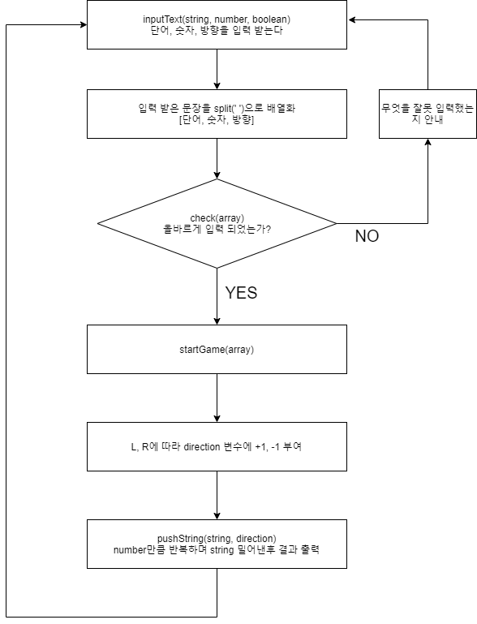

# codeSquad-mastersCourse-test step-1

## 단어 밀어내기 구현하기

1. 사용자로부터 단어 하나, 정수 숫자 하나 (-100 &lt; N &lt; 100), L 또는 R을 입력 받는다 (대소문자 둘 다 가능)
2. 주어진 단어를 정수 숫자만큼, L 또는 R 방향으로 밀어낸다
3. 밀려난 단어는 사라지지 않고 반대쪽으로 채워진다.

### 예시
홀추 줄은 입력, 짝수 줄은 출력이다. 

    > apple 3 L 
    leapp

    > banana 6 R
    banana

    > carrot -1 r
    arrotc

    > cat -4 R
    atc

### 1단계 요구사항
- 컴파일 및 실행되지 않을 경우 불합격
- 자신만의 기준으로 최대한 간결하게 코드 작성

### 예상 순서도 

### 예상하기

split(' ')으로 배열화하면 [단어, 숫자, 방향]으로 길이가 3인 array가 나와야한다.   
길이가 3이 아니거나, 길이가 3이더라도 0 1 2인덱스의 요소가 단어, 숫자, 방향이 아니라면 오류를 내야함.

check(array) 
- array[0]이 함수에서 제대로된 단어 입력시(숫자가 섞였는가? 한글이 섞여있는가? => 혹은 상관없음?) return false
- array[1]이 숫자가 정해진 범위를 넘어서면 return false
- array[2]이 R(r), L(l)외에 다른 것이 return false
- 세 조건을 모두 만족하면 return true

startGame(array)   
check()가 true를 return하면 실행   
비구조화 할당으로 array의 요소를 string, num, direction으로 나눔   
이때 num이 0이라면 종료하고 return string   
direction * num으로 vector 값을 얻어낸다.(최종으로 음수면 왼쪽, 양수면 오른쪽으로)

pushString호출   
?? num만큼 pushString을 호출하는것과 pushString에 num을 인자로 넘겨    그 안에서 반복문을 실행하는 것이 큰 차이가 있을까??   
혹은 재귀로하는게 더 직관적일까?(근데 재귀로 하면 느림)

pushString(string, direction)   
string을 direction 방향으로 한 칸씩 민다.
최종 결과 return 